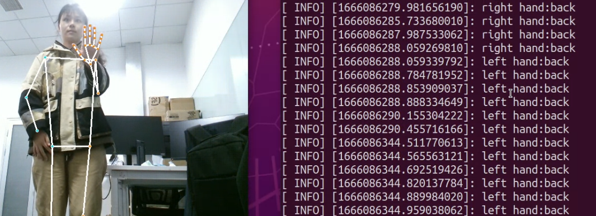
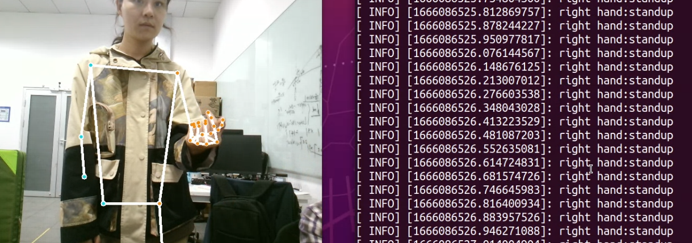
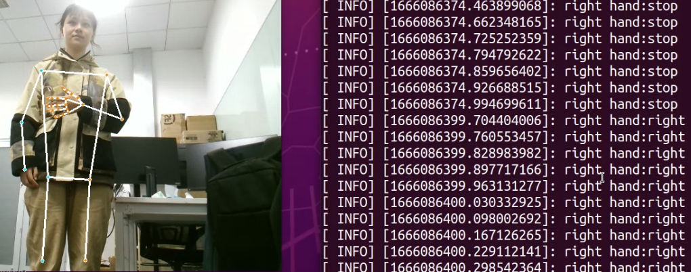

# Dynamic Gesture Recognition

Gestures are divided into 'forward', 'back', 'back', 'stand up', 'sit', 'stop'.

---
### Skeleton Recognition
Mediapipe can be visit in https://www.baidu.com/link?url=tQDslAk0r-bUdu0uWlf5PxBVSvPf08mnyDfyk_j5jwK&wd=&eqid=96e268b60014880100000006636c0dfa

### Gesture Recognition
some exmaples: 
'back'

'standup'

'right'
